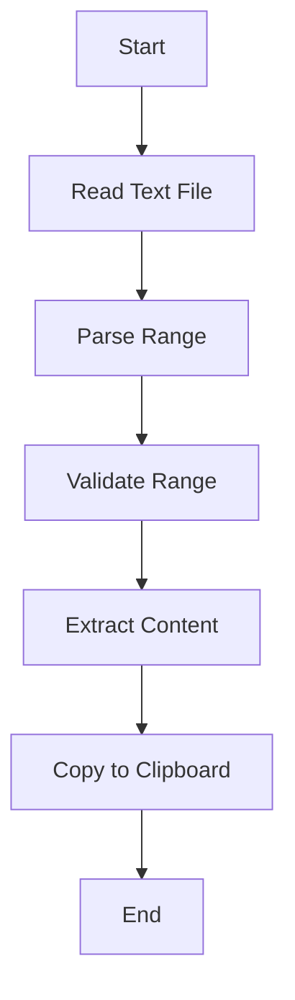
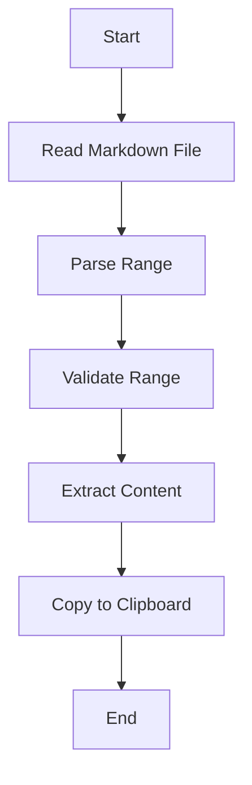

# Data Flow Diagrams

## Text File Parsing



## Markdown File Parsing



## JSON File Parsing

```mermaid
flowchart TD
    A[Start] --> B[Read JSON File]
    B --> C[Parse Range]
    C --> D[Validate Range]
    D --> E[Extract Content]
    E --> F[Copy to Clipboard]
    F --> G[End]